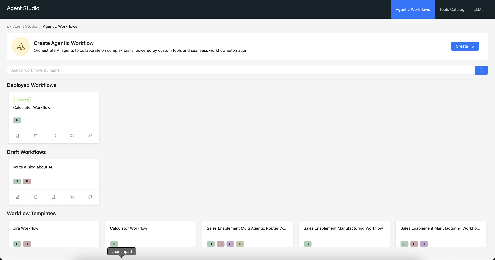

# Cloudera AI Agent Studio

> IMPORTANT: Please read the following before proceeding. This AMP includes or otherwise depends on certain third party software packages. Information about such third party software packages are made available in the notice file associated with this AMP. By configuring and launching this AMP, you will cause such third party software packages to be downloaded and installed into your environment, in some instances, from third parties' websites. For each third party software package, please see the notice file and the applicable websites for more information, including the applicable license terms.

> If you do not wish to download and install the third party software packages, do not configure, launch or otherwise use this AMP. By configuring, launching or otherwise using the AMP, you acknowledge the foregoing statement and agree that Cloudera is not responsible or liable in any way for the third party software packages.

> Copyright (c) 2025 - Cloudera, Inc. All rights reserved.

## About the Studio
Cloudera AI Agent Studio is a low-code and powerful platform for building, testing, and deploying AI agents and workflows. It provides an intuitive interface for creating custom AI tools and combining them into sophisticated automated workflows.

## Getting Started

### User Guide
The usual process of using the studio is as follows:
 1. Configure an AI model to use. ([Models User Guide](./docs/user_guide/models.md))
 2. Create new tools or go through our existing set of tools. *This step is optional.* ([Tools User Guide](./docs/user_guide/tools.md))
 3. Create, test, deploy and manage workflows. ([Workflows User Guide](./docs/user_guide/workflows.md))
 4. Monitor your workflows. ([Monitoring User Guide](./docs/user_guide/monitoring.md))
 5. Build custom UIs and [Applications](https://docs.cloudera.com/machine-learning/cloud/applications/topics/ml-applications-c.html) on top of your deployed workflows. ([Custom Applications Guide](./docs/user_guide/custom_workflow_application.md))

## High Level Features
- Agent Studio ships with a set of pre-built tools and workflows (called "templates"). Use these to get started quickly.
- Create custom tools and workflows. Test the workflows in the studio. Save them as templates for reuse.
- Workflows can be deployed as standalone [Workbench Applications](https://docs.cloudera.com/machine-learning/cloud/applications/topics/ml-applications-c.html), and can be used indipendently of the studio.
