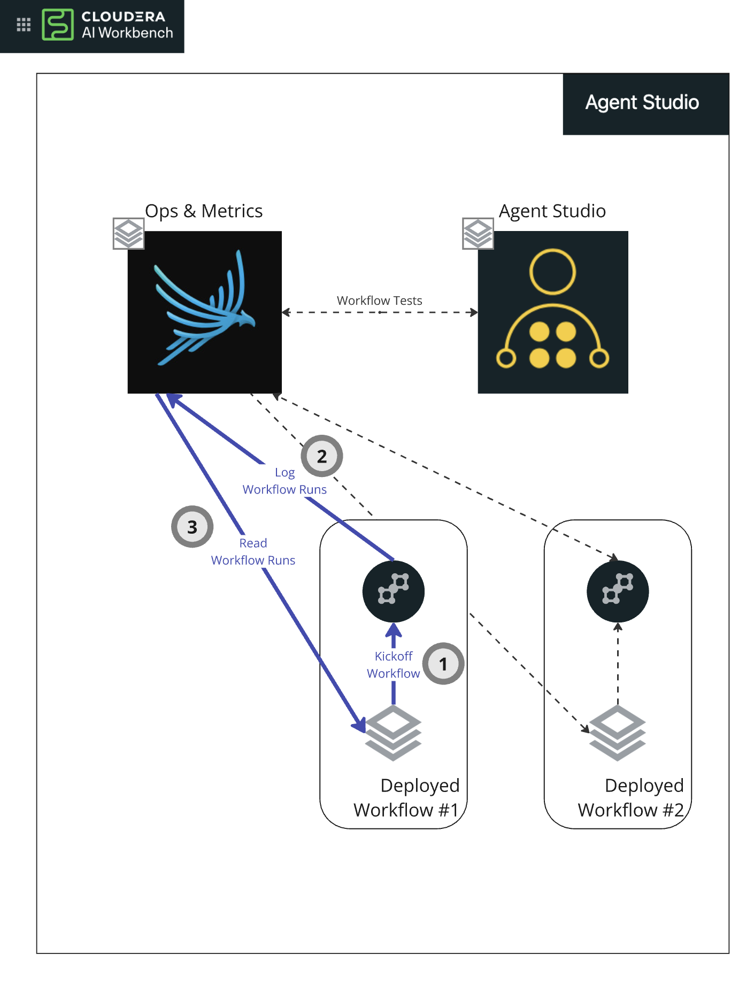
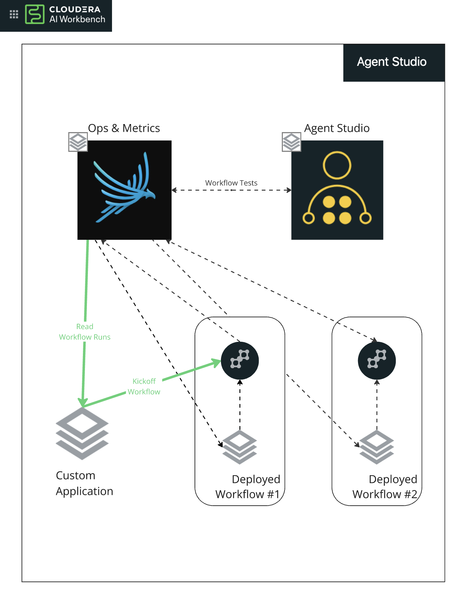
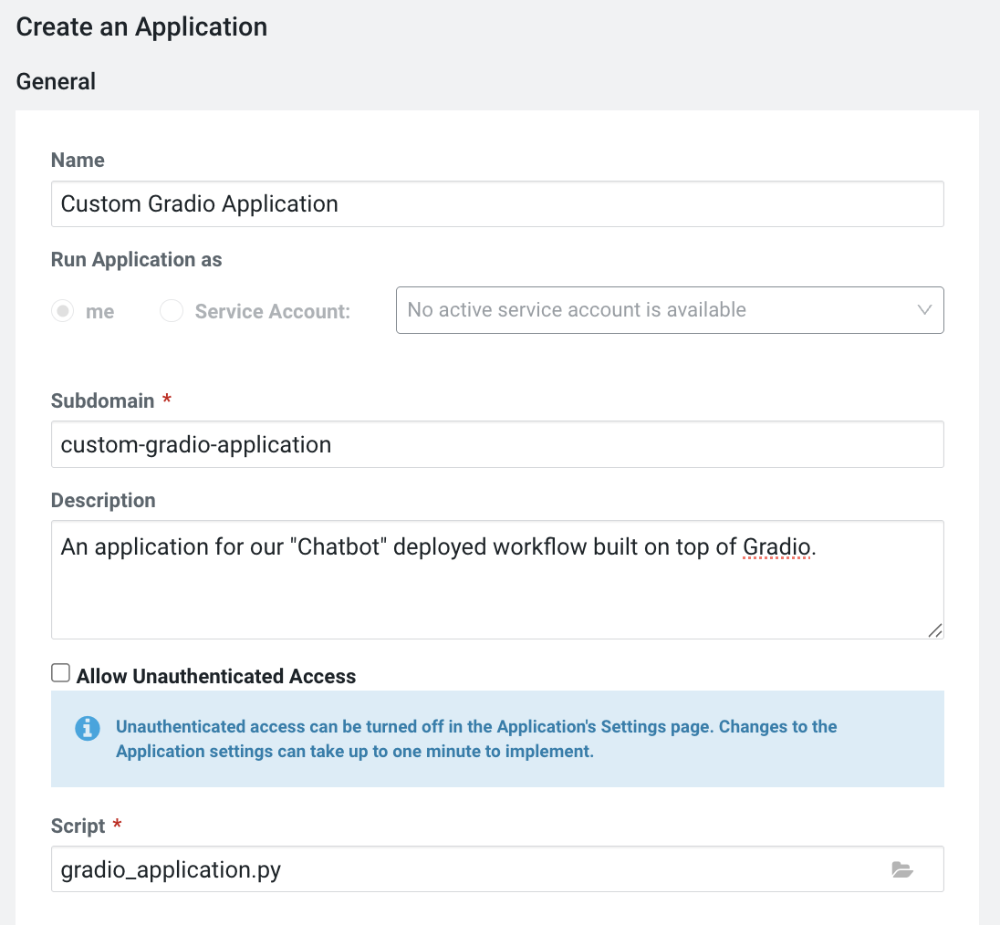
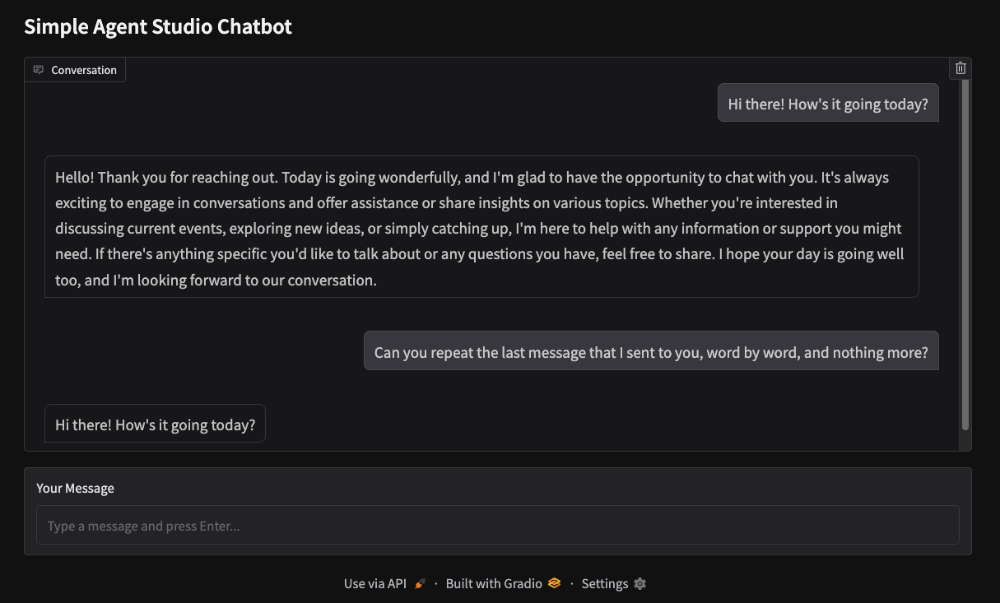
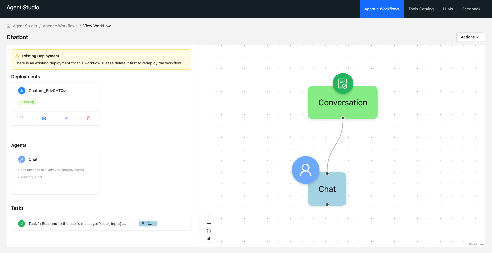

# Creating Custom UIs and Applications for Deployed Workflows

This guide discusses how to create your own applications and UIs to drive Agent Studio's deployed workflows.

## Overview

Let's overview the full ecosystem that Agent Studio provides when adding the studio to your project (**Figure 1**):
* The studio application itself, which is a [Workbench Application](https://docs.cloudera.com/machine-learning/cloud/applications/topics/ml-applications-c.html)
* An Ops and Metrics server powered by the open-source [Phoenix](https://phoenix.arize.com/) ([Github](https://github.com/Arize-ai/phoenix)) to log and retrieve workflow runs
* For every deployed workflow, a dedicated [AI Workbench Model](https://docs.cloudera.com/machine-learning/cloud/models/topics/ml-models.html), and Application to drive each workflow

For every workflow that you deploy, the Model hosts all of the workflow's tools and other workflow metadata. This model exposes a few endpoints to either kickoff a new workflow, or retrieve information about the workflow (these endpoints are discussed through this page).

There is also a "default" Workbench Application for each deployed workflow provides a visual interface to kickoff a workflow's Model, and retrieve information about the currently running workflows. This Application, by default, is the same UI that you see when you're testing your workflows from within the Studio. The lifecycle of an Agent Studio workflow execution is as follows (see **Figure 1**):
1) The end user interacts with the deployed workflow's Application, which sends requests to the corresponding Model to execute ("kickoff") a workflow. Once a workflow has initiated execution, the Model responds with a unique ID that corresponds with this workflow request (i.e. `{"trace_id": "4ec9e40f8e68d218d2dbae55a8120be0"}`)
2) The newly kicked off workflow will complete execution from within the Model, and continuously stream workflow **events** (task start/stop, tooling start/stop, LLM completions, etc.) to Agent Studio's Phoenix ops server. As of March 2025, we are logging a slight variation of the [OpenInference](https://github.com/Arize-ai/openinference)'s telemetry standard.
3) The deployed Application will continuously poll the events of a specific workflow (queried by the `trace_id` created when the workflow was kicked off) using [Phoenix's provided GraphQL endpoint](https://docs.arize.com/arize/resources/graphql-api). The UI will then display live visuals of how the workflow is progressing.


### Figure 1: Deployed Workflow Application & Model Lifecycle


## Custom Applications

Users have the ability to create custom applications that can interact with deployed workflow models (see **Figure 2** below), as long as the applications are created from within the same project as Agent Studio. A custom workflow application needs to:

* Execute (or "kickoff") a workflow, and 
* Retrieve events from a kicked off workflow to display results to the end user

### Figure 2: Custom Workflow Applications


Since both the workflow Model and Application are standard Cloudera AI Workbench constructs, users can build custom interfaces completely from the ground up (i.e., call a deployed Model's endpoint URL directly with HTTP requests, and query the Phoenix server directly through the GraphQL endpoint). However, for simple custom applications (i.e. a Gradio app), this is a fairly large amount of overhead.

## Agent Studio's Workflow SDK

Agent Studio ships with an SDK to help users natively build custom Python UIs and Applications on top of deployed workflows. This SDK handles a lot of the communications layer with the Model hosting the workflow, as well as the Phoenix ops server. Here's a simple example that kicks off a deployed workflow named `"Chatbot"`:

```python
from studio.sdk.workflows import (
    run_workflow, 
    get_workflow_status
)
from time import sleep

run_id = run_workflow(name="Chatbot", inputs={"user_input": "hi there!", "context": []})

workflow_status = {}
while not workflow_status.get("complete"):
    sleep(1)
    workflow_status = get_workflow_status(run_id)
    
print(workflow_status["output"])

```

Note that as mentioned above, workflows are asynchronous by nature. If you're building an application expecting synchronous behavior (i.e., running the workflow will block your scripts until the workflow is complete), then you can implement a polling mechanism similar to this example above. (see **Example: Gradio Application** below).

### A Note on Conversational Workflows

Conversational workflows always expect two inputs to the workflow: `user_input` and `context`. Conversational context must be handled from within the application logic. An example of passing context may look like this:

```python
run_id = run_workflow("Chatbot", inputs={
    "user_input": "what's the last message you said?", 
    "context": [
        {"role": "User", "content": "Well hello there!"},
        {"role": "System", "content": "Hi there! How can I assist you today?"}
    ]
})
```

*Note that a specific format of the context is not required, but it's suggested to adhere to standards that your LLMs are trained on. All of these inputs will be serialized into a string when passing information to the LLM.*

## Example: Custom Gradio UI for a Conversational Workflow

Agent Studio's Workflow SDK makes it simple to build custom UIs and applications on top of a deployed workflow. Here's an example of a Gradio UI for a conversational workflow. If you want to build along, create a `gradio_driver.py` file either in your project's root directory, or within the `agent-studio/` directory if you've deployed Agent Studio as an AI Studio, or anywhere else and add your UI driving code:


```python
import gradio as gr
import time
import os 

from studio.sdk.workflows import run_workflow, get_workflow_status


# This is the name of the workflow in Agent Studio. This workflow
# is a deployed workflow, and the agent studio SDK methods will
# perform proper discovery on the workflow's endpoints.
WORKFLOW_NAME = "Chatbot"


def respond(user_message, chat_history, context):

    chat_history.append([user_message, None])

    context.append({"role": "User", "content": user_message})

    run_id = run_workflow("Chatbot", inputs={
        "user_input": user_message,
        "context": context,
    })

    workflow_status = {}
    while not workflow_status.get("complete"):
        time.sleep(1)
        workflow_status = get_workflow_status(run_id)

    agent_reply = workflow_status["output"]

    chat_history[-1][1] = agent_reply
    context.append({"role": "Assistant", "content": agent_reply})

    return chat_history, context


with gr.Blocks() as demo:
    gr.Markdown("## Simple Agent Studio Chatbot")

    chatbot = gr.Chatbot(
        label="Conversation",
        elem_id="chatbot"
    )

    txt = gr.Textbox(
        label="Your Message",
        placeholder="Type a message and press Enter...",
    )

    context_state = gr.State([])

    txt.submit(
        fn=respond,
        inputs=[txt, chatbot, context_state],
        outputs=[chatbot, context_state]
    )


demo.queue().launch(server_port=int(os.getenv("CDSW_APP_PORT")))
```


### Deploying Custom UIs as Workbench Applictions

Anything built using Agent Studio's SDKs can be deployed as a workbench application. Here's an example of how to run the Gradio UI above as an application. 

#### Figure 4: Gradio Application Configuration



And the application entrypoint, `gradio_application.py`, which calls the UI driver code, `gradio_driver.py`:

```python
# This script assumes that our UI driving code exists in the agent_studio/
# directory, which is where our Agent Studio (and the SDK) is deployed
# if you add Agent Studio as an AI Studio.
import os
os.chdir("/home/cdsw/agent-studio")

# Run our Gradio application and use `uv`, which is the package
# manager used for Agent Studio and its SDK
!uv run gradio_driver.py
```

That's all it takes! With ~50 lines of code, we've built a custom workflow UI to run on top of an Agent Studio workflow.



## Advanced Concepts

Some customers might want more advanced workflow UIs than the example above. For example, in the "default" workflow application, Agent Studio provides a flow diagram written in [React Flow](https://reactflow.dev/) that streams live updates of what the agents are thinking. This section describes some concepts that allow advanced application developers to push their UIs to the next level.

###  Live Streaming Workflow Events

Since workflows execute asynchronously by nature, the SDK `get_workflow_status` method can provide the current status of workflows, even if the workflow is not yet complete, and the returned **workflow events** can be used to extract even more fine grained information from workflows.

Workflow events (also referred to intermittently as *traces* and *spans* depending on the context of the conversation) represent milestones of a workflow execution, such as task assignment, tool usage, and LLM calls. Each of these events log their own attributes. It's recommended to deserialize each event attribute individually based on the event type. The following event types are logged in Agent Studio:

```python
[
    "Crew.kickoff",
    "Agent._start_task",
    "completion",
    "ToolUsage._use",
    "ToolUsage._end_use",
    "Agent._end_task",
    "Crew.complete",
]
```

When calling `get_workflow_events`, each of these event types are objects that will have a `name` field, a variety of other fields, and most importantly, an `attributes` field. The `attributes` field will be different for each event type above. Given the type of event, specific steps can be taken to extract information from the event attributes.

An example excerpt (with some items redacted) of the output you can expect from the `get_workflow_status` SDK method is below:

```json
{
  "complete": true,
  "output": "The last message I said was: \"Hi there! How can I assist you today?\"",
  "events": [
    {
      "id": "U3BhbjoxMzk3",
      "name": "Crew.kickoff",
      "startTime": "2025-03-13T15:37:15.899322+00:00",
      "endTime": "2025-03-13T15:37:15.899640+00:00",
      "attributes": {
        ...
      }
    },
    {
      "id": "U3BhbjoxNDAx",
      "name": "Agent._start_task",
      "startTime": "2025-03-13T15:37:15.944827+00:00",
      "cumulativeTokenCountCompletion": 31,
      "endTime": "2025-03-13T15:37:15.944958+00:00",
      "attributes": {
        "agent_role": "Chat",
        "task": {
          "expected_output": "Provide a response that aligns with the conversation history.",
          "description": "Respond to the user's message: 'what's the last message you said?'. Conversation history:\n[{'role': 'User', 'content': 'Well hello there!'}, {'role': 'System', 'content': 'Hi there! How can I assist you today?'}]."
        },
        ...
      },
      "events": []
    },
    {
      "id": "U3BhbjoxNDAy",
      "name": "completion",
      "startTime": "2025-03-13T15:37:15.956574+00:00",
      "attributes": {
        "input": {
          "value": "[{\"role\": \"system\", \"content\": \"You are Chat. Chat\\nYour personal goal is: Respond in a very very lengthy output\\nTo give my best complete final answer to the task respond using the exact following format:\\n\\nThought: I now can give a great answer\\nFinal Answer: Your final answer must be the great and the most complete as possible, it must be outcome described.\\n\\nI MUST use these formats, my job depends on it!\"}, {\"role\": \"user\", \"content\": \"\\nCurrent Task: Respond to the user's message: 'what's the last message you said?'. Conversation history:\\n[{'role': 'User', 'content': 'Well hello there!'}, {'role': 'System', 'content': 'Hi there! How can I assist you today?'}].\\n\\nThis is the expect criteria for your final answer: Provide a response that aligns with the conversation history.\\nyou MUST return the actual complete content as the final answer, not a summary.\\n\\nBegin! This is VERY important to you, use the tools available and give your best Final Answer, your job depends on it!\\n\\nThought:\"}]"
        },
        "llm": {
          ...
          "output_messages": [
            {
              "message": {
                "role": "assistant",
                "content": "Thought: I now can give a great answer\nFinal Answer: The last message I said was: \"Hi there! How can I assist you today?\""
              }
            }
          ],
          ...
          "token_count": {
            "prompt": 217,
            "total": 248,
            "completion": 31
          },
          "model_name": "openai/gpt-4o"
        },
        "output": {
          "value": "Thought: I now can give a great answer\nFinal Answer: The last message I said was: \"Hi there! How can I assist you today?\""
        },
        "openinference": {
          "span": {
            "kind": "LLM"
          }
        }
      },
      "events": []
    },
    ...
    {
      "id": "U3BhbjoxNDA0",
      "name": "Crew.complete",
      "startTime": "2025-03-13T15:37:16.627146+00:00",
      "endTime": "2025-03-13T15:37:16.627295+00:00",
      "attributes": {
        "crew_output": "The last message I said was: \"Hi there! How can I assist you today?\""
      },
      "events": []
    }
  ]
}
```

### Getting Workflow Details

For more complex visualizations, it might be important for applications to extract information about the workflow without actually running the workflow. Luckily, all of our workflow Models are introspective. We can send requests to the model endpoint to request information about the workflow that the model is responsible for running. Let's take a look at our very simple Chatbot workflow here:



Once we have the workflow deployed, we can use the `get_workflow_configuration` SDK method to extract out some information about the workflow:

```python
from studio.sdk.workflows import get_workflow_configuration

config = get_workflow_configuration("Chatbot")
print(json.dumps(config, indent=2))
```

The example output is as follows:

```json
{
  "agents": [
    {
      "agent_image_uri": "",
      "crew_ai_allow_delegation": false,
      "crew_ai_backstory": "Chat",
      "crew_ai_cache": false,
      "crew_ai_goal": "Respond in a very very lengthy output",
      "crew_ai_max_iter": 0,
      "crew_ai_role": "Chat",
      "crew_ai_temperature": null,
      "crew_ai_verbose": false,
      "id": "b1f86b52-f667-4eff-a07f-71adfbf3b728",
      "llm_provider_model_id": "",
      "name": "Chat",
      "tool_instance_ids": []
    }
  ],
  "default_language_model_id": "7d90ade4-f2e0-49dd-be11-9080c9612f1e",
  "language_models": [
    {
      "config": null,
      "generation_config": {
        "do_sample": true,
        "max_length": null,
        "max_new_tokens": 4096,
        "num_beams": 1,
        "temperature": 0.7,
        "top_k": 50,
        "top_p": 1
      },
      "model_id": "7d90ade4-f2e0-49dd-be11-9080c9612f1e",
      "model_name": "cml"
    }
  ],
  "tasks": [
    {
      "assigned_agent_id": "b1f86b52-f667-4eff-a07f-71adfbf3b728",
      "description": "Respond to the user's message: '{user_input}'. Conversation history:\n{context}.",
      "expected_output": "Provide a response that aligns with the conversation history.",
      "id": "defa76e9-df9a-4fbc-9f4a-4253bae8a769"
    }
  ],
  "tool_instances": [],
  "workflow": {
    "agent_ids": [
      "b1f86b52-f667-4eff-a07f-71adfbf3b728"
    ],
    "crew_ai_process": "sequential",
    "deployment_id": "Edv0HTQz",
    "id": "6bddfed8-701b-468a-90e0-4308a5f4d725",
    "is_conversational": true,
    "llm_provider_model_id": null,
    "manager_agent_id": null,
    "name": "Chatbot",
    "task_ids": [
      "defa76e9-df9a-4fbc-9f4a-4253bae8a769"
    ]
  }
}
```

So clearly, we can get a lot of information about the workflow itself, just from requesting information from the workflow model! In fact, this is exactly what the "default" application does to initially render the React Flow diagram.

### Detecting Errors in Workflows

Phoenix AI (and OpenInference logging standards) typically place errors (such as LLM token errors, RateLimitExceeded errors, and any other tool errors) in the `events` field of a workflow event (*note: yes, the idea of having `events` within an event is a bit confusing. The historical precedence here is that a workflow "event" is really just a "trace" or "span" in OpenTelemetry, and these objects can record a list of their own events*). The SDK will natively check for any blocking errors and will report a workflow being complete, even if a `Crew.complete` event did not happen yet.


