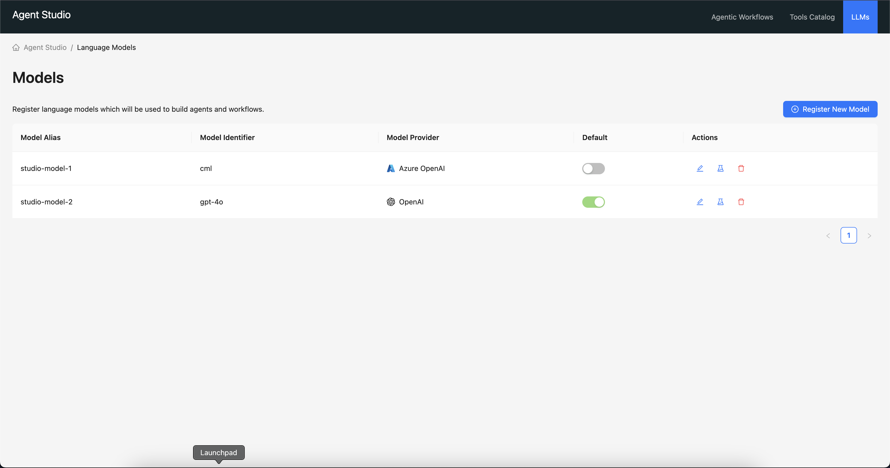

# Cloudera AI Agent Studio - Models

## Overview

The "LLMs" tab in the Studio allows you to configure the AI models you want to use. Atleast one model must be configured, for proper operation of the studio. The first model configured will be the default model used for all agent runs. You can change the default model anytime by regsitering new models and setting them as the default.

## Registering Models

To register a new model, click on the "Register New Model" button. We support the following model providers out of the box(with more providers coming soon):
 - OpenAI
 - Azure OpenAI
 - OpenAI compatible providers (any model endpoint that adheres to the [OpenAI API specifications](https://platform.openai.com/docs/api-reference/chat))
   - You can use this to connect to models hosted within your enterprise boundaries or on [Cloudera AI Inference Service](https://docs.cloudera.com/machine-learning/cloud/ai-inference/topics/ml-caii-use-caii.html).

## Editing Regsitered Models

You would find an "Edit Model" button for each registered model. Clicking on the same would allow you to edit the model details. Apart from the model provider, all other fields are editable. To set a new API key for the model, you can enter a new API key in the "API Key" field. If left blank, the existing API key will be retained.

## Testing Models

Agent Studio gives you the ability to test a registered model with a simple prompt to validate the credentials and network connectivity for the model.
