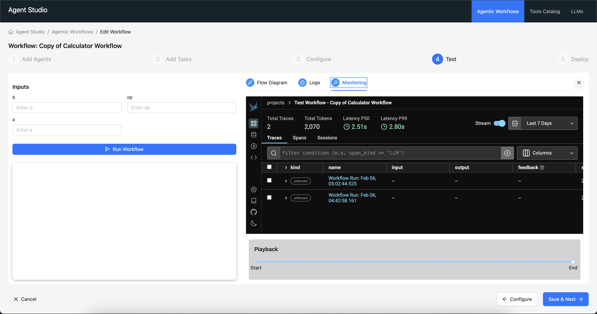

# Cloudera AI Agent Studio - Monitoring

We use [Phoenix](https://github.com/Arize-ai/phoenix) to instrument our workflows for observability.

Phoenix application is set up as part of studio deployment steps. Agent Studio is dependant on Phoenix to be deployed and running before it can start monitoring workflows. All our workflows (whether in test mode or deployed) are kicked off asynchronously, and the traces flow into Phoenix. We tap into the Phoenix API to get the traces and display them in the studio.

Phoenix exposes a [GraphQL API](https://docs.arize.com/arize/resources/graphql-api) that we can use to get the traces.

## How to use the monitoring feature ?

 1. On the test page, pheonix is iframed in a separate tab.

 2. At the workbench project, you can find the full fledged Phoenix application running. All the test and deployed workflows report to this instance of Phoenix.

**NOTE**: Due to certain technical limitations, we need to restart the studio application if the Phoenix application is restarted, to inject updated IP address of the Phoenix application into the studio.
