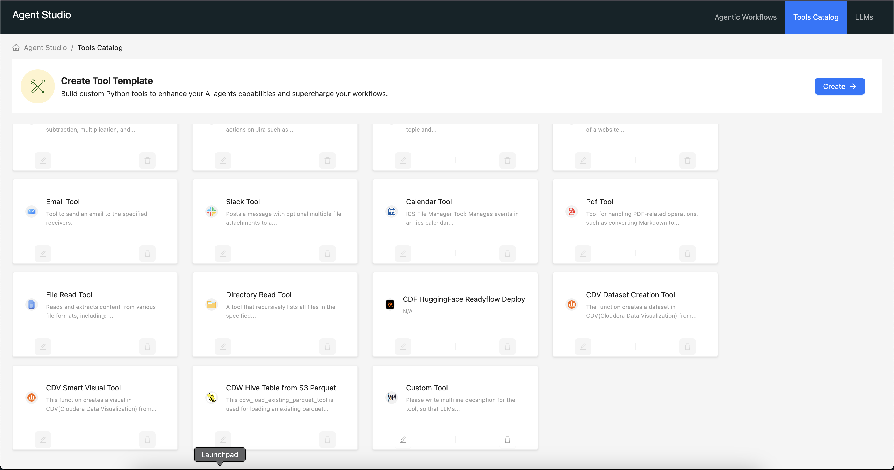

# Cloudera AI Agent Studio - Tools

## Overview

Tools are the building blocks of AI agents and workflows. They let the agents talk to external systems(DBs, APIs, etc), or do tasks which might prove difficult for an LLM to do.

The format used for defining a tool is heavily inspired by one used by [CrewAI](https://docs.crewai.com/concepts/tools#creating-your-own-tools).
Agent Studio ships with a set of pre-built tools, and allows you to create your own(and save it as a template).

## Pre-built tools

Agent Studio ships with the following tools out-of the box:

#### [Calculator](../../.studio-data/tool_templates/calculator/tool.py)

The calculator tool lets you perform basic arithmetic operations. This tool mainly serves as an example of how to create a tool.

#### [Jira Integration](../../.studio-data/tool_templates/jira_integration/tool.py)

The Jira integration tool lets you create, update, delete and search issues from Jira.

The tool requires the following configurations:
- Jira URL
- Authentication token
- Email registered with Jira

#### [Web Search](../../.studio-data/tool_templates/search_internet/tool.py)

The web search tool lets you search the internet for information(Equivalent of a Google search).

The tool requires the following configurations:
- [Serper](https://serper.dev/) API key

#### [Webpage Scraper](../../.studio-data/tool_templates/scrape_website/tool.py)

The webpage scraper tool lets you scrape the content of a webpage given a URL.

#### [Email Tool](../../.studio-data/tool_templates/email_tool/tool.py)

The email tool lets you send email via an SMTP server.

The tool requires the following configurations:
- SMTP Server - The address of the SMTP server.
- SMTP Port – The port number for the SMTP connection.
- SMTP Password – The authentication password for the SMTP server.

#### [Slack Tool](../../.studio-data/tool_templates/slack_tool/tool.py)

The slack tool lets you send slack messages to users by providing the email id or any channel using a Slack bot.

The tool requires the following configurations:
- [Slack API Token](https://api.slack.com/tutorials/tracks/getting-a-token)

#### [Calendar Tool](../../.studio-data/tool_templates/calendar_tool/tool.py)

The calendar tool lets you create, update, delete events in an .ics calendar file.

#### [PDF Tool](../../.studio-data/tool_templates/pdf_tool/tool.py)

The PDF tool lets you convert Markdown content into a PDF file or read an existing PDF file.

**Note:** The tool can only read PDF files that are uploaded to the project in which AMP is deployed. Users need to upload their files before using this tool.

#### [File Read Tool](../../.studio-data/tool_templates/fileread_tool/tool.py)

The File Read Tool lets you read the contents of a given file.

**Note:** This tool can only access files that are within the project where AMP is deployed. Users must upload their files before attempting to read them using this tool.

#### [Directory Read Tool](../../.studio-data/tool_templates/directoryread_tool/tool.py)

The Directory Read Tool lets you read all the files in the given directory.

The tool requires the following configuration:
- Directory path for file listing

**Note:** The tool can only read directories that exist within the project in which AMP is deployed. Users need to upload their files to the appropriate project directory before using this tool.

#### [Cloudera DataFlow HuggingFace Readyflow Deploy Tool](../../.studio-data/tool_templates/cdf_readyflow_deploy_hf_tool/tool.py)

The Cloudera DataFlow HuggingFace Readyflow Deploy Tool lets you import a huggingface dataset into a path in the CDP datalake.

The tool requires the following configurations:
- CDP workload username - The username for accessing CDP workloads.
- CDP API  Access Key - Used for authentication with the CDP API.
- CDP API Private Key - Works alongside the Access Key for secure API access.
- CRN of a running CDP Dataflow service - The unique identifier of an active CDP DataFlow service instance.

#### [Cloudera Data Visualization Dataset Creation Tool](../../.studio-data/tool_templates/cdv_dataset_tool/tool.py)

The Cloudera Data Visualization Dataset Creation Tool lets you create a dataset in CDV(Cloudera Data Visualization) from a SQL table.

The tool requires the following configurations:
- Dataset connection ID - The identifier for the data connection in CDV.
- CDV Base URL - The URL of your Cloudera Data Visualization instance.
- CML APIv2 Application Key - Required for authentication with Cloudera Machine Learning (CML) APIs.

#### [Cloudera Data Visualization Smart Visual Tool](../../.studio-data/tool_templates/cdv_smart_visual_tool/tool.py)

The Cloudera Data Visualization Smart Visual Tool lets you create a visual in CDV(Cloudera Data Visualization) from a dataset.

The tool requires the following configurations:
- CDV Base URL - The URL of your Cloudera Data Visualization instance.
- CML APIv2 Application Key - Required for authentication with Cloudera Machine Learning (CML) APIs.

#### [Cloudera Data Warehouse Hive Table from S3 Parquet](../../.studio-data/tool_templates/cdw_hive_from_s3_parquet/tool.py)

The Cloudera Data Warehouse Hive Table from S3 Parquet lets you load an existing parquet file in s3 as a table accessible in CDW. It returns some sample data from the created table to prove the table exists.

The tool requires the following configurations:
- Workload User – The username for accessing the CDW workload.
- Workload Password – The corresponding password for authentication.
- Hive CAI Dataconnection Name – The name of the data connection used to connect Hive to the Parquet file in S3.

## Creating Custom Tools

You can create custom tools directly at the time of workflow creation, or seprately by going to the `Tools Catalog` tab in the top navigation bar.

Agent Studio will automatically generate a template (`tool.py` & `requirements.txt`) with appropriate comments for each component of the tool.
Let's understand the different components of a tool:
 - `class UserParameters:` This class defines the parameters need to configure a tool to interact with the external system(like URLs, API keys, etc). The parameters which can't be really determined by the LLM needs to go here.
 - `class ToolParameters:` This class defines the parameters which can be determined by the LLM. Each parameter is annotated with a description and a type, and this information is used by the LLM to suggest the correct values. The class should be nested inside the class which defines the main tool.
 - `class <tool-name>:` This class defines the main tool. It should inherit from `StudioBaseTool` class. It contains the `name` and `description` of the tool, along with a `_run` method which contains the logic of the tool. The `name` and `description` should have the type annotation as `str`.

You have the option to edit the name of the tool. Description of the tool is picked up the from `description` variable in the `class <tool-name>` block. Additionally, you can add a icon to the tool from the Studio UI.
Each tool runs in its own isolated Python environment, thus allowing you to use any dependencies you want(to be mentioned in the `requirements.txt` file).

## **Extending Capabilities**  

When creating a tool from a template, you can **extend its functionality** by:  
- Modifying tool logic  
- Adding new parameters  
- Integrating with additional APIs  

This flexibility allows you to tailor tools for specific workflows and agent needs. 

To edit the the tool code or requirements, you can click on the `Edit Tool File` button in the "View Tool" page. Clicking it would redirect you to a AI workbench file deeplink, so that you can make your edits & test there. For security reasons, we don't allow editing of the tool files in the Studio UI.